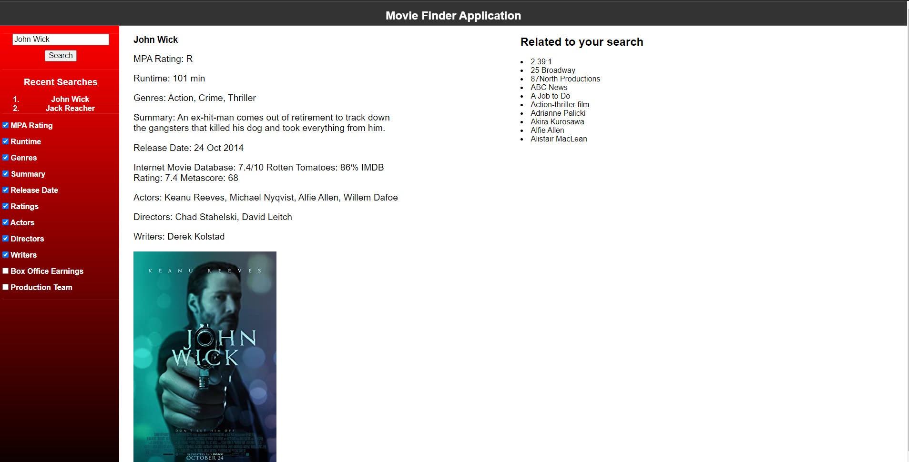

# MovieFinder App

## Table of Contents

 

[Description](#description)

[Usage](#Usage)

[Credits](#Credits)

 

## Description

 

This project allows the user to search for a movie a have information displayed about the movie and related media. The information shown can be customized using checkboxes in the side panel. All searches will be saved to local storage and the last four searches will be displayed underneath the search bar. The user can click on one of the history items to make them appear in the search bar.

The movie information is fetched from OMDB and the related media is fetched from the Wikipedia database. In the event that the user types in a title that's not available, they will receive a message telling them so. If the related media information fails to load due to linking inconsistencies, another message will display telling them so. This project utilizes the pure css library for formatting purposes.

 
 

## Usage
 
To access the website, go to https://ngkent75.github.io/moviefinderapp/

 
 

Click on the search bar in the side panel and type in a movie title. Use the checkboxes to customize what information you would like to see. Once you finished, simply click
 

 

Information related to the movie and related media will appear depending on the criteria you selected in the checkboxes. A poster of the movie will also be displayed. Your search will be saved to local storage and displayed in a list of your history below the search bar. Clicking on one of the list items in the history will put the text into the search bar.
 

 

If you search something that is not a valid movie title, you will recieve an error message.
 

 

The HTML dynamically updates to mobile screens. The content will stack vertically and the side panel becomes a hamburger menu.
 

 

## Credits

 

Nathan Kent: https://github.com/ngkent75

Brandon Carter: https://github.com/Brandnn07

Nicholas Marrone: https://github.com/NicholasMarrone-1997

 

Pure CSS: https://purecss.io/